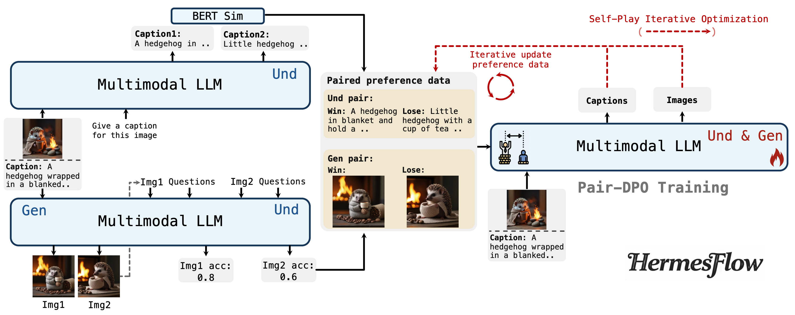
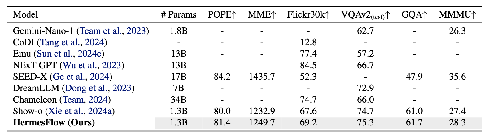
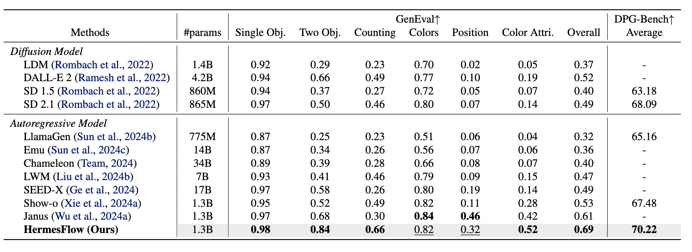

# HermesFlow: Seamlessly Closing the Gap in Multimodal Understanding and Generation
<p align="left">
  <a href='https://arxiv.org/abs/2502.12148'>
  </a> 
  <a href='https://huggingface.co/Gen-Verse/HermesFlow'>
  </a>
  <a href="" target='_blank'>
  </a> 
</p>

This repository contains the official implementation (including data, scripts and model weights) of [HermesFlow](https://arxiv.org/abs/2502.12148).


## Introduction



HermesFlow is a general alignment framework for multimodal LLMs, which cruate homologous preference data itself and utilize self-play iterative optimization with Pair-DPO to seamlessly close the gap between multimodal understanding and generation.


## New Updates

**[2025.2]** Checkpoint of HermesFlow is publicly available on [HuggingFace Repo](https://huggingface.co/Gen-Verse/HermesFlow).

**[2025.2]** Our main code of HermesFlow is released.

## Installation

```shell
git clone https://github.com/Gen-Verse/HermesFlow
cd IterComp
conda create -n HermesFlow python==3.8.10
conda activate HermesFlow
pip install -r requirements.txt
```

## Curate Homologous Preference Date

We randomly select 5,000 image-caption pairs from [JourneyDB](https://huggingface.co/datasets/JourneyDB/JourneyDB) as the homologous input data, and store the detailed information in `datasets/journeydb/initial_data.json` in the following format：

```json
[
    {
        "id": 238,
        "img_path": "datasets/journeydb/initial_images/238.jpg",
        "prompt": "raccoon wearing a hat made of orange roses wallpaper pattern",
        "caption": "A raccoon wearing a hat made of an orange roses wallpaper pattern."
    },
 ]
```

For the curation of understanding preference data:

```shell
python3 inference_mmu_caption.py config=configs/hermesflow_demo_512x512.yaml
```

Understanding result is saved at  `datasets/journeydb/understanding_caption_results.json` .

For the curation of generation preference data, first you should generate images according to input prompts:

```shell
python3 inference_t2i.py config=configs/hermesflow_demo_512x512.yaml batch_size=1 guidance_scale=5 generation_timesteps=50 mode='t2i'
```

We recommend using [TIFA](https://github.com/Yushi-Hu/tifa) to complement VQA data for a more comprehensive evaluation of generated images:

```shell
python3 get_vqa_tifa.py
```

Then, use MLLM itself to conduct VQA evaluation on these generated images:

```shell
python3 inference_mmu_vqa.py config=configs/hermesflow_demo_512x512.yaml
```

Generation result is saved at  `datasets/journeydb/generation_vqa_results.json` .

Finally, get the homologous preference data for Pair-DPO using:

```shell
python3 datasets/journeydb/get_dpo_data.py
```

The final homologous preference data is save at  `datasets/journeydb/pair_dpo_data.json` in the following format:

```json
[
  	{
        "id": 238,
        "img_path": "datasets/journeydb/initial_images/238.jpg",
        "prompt": "raccoon wearing a hat made of orange roses wallpaper pattern",
        "caption": "A raccoon wearing a hat made of an orange roses wallpaper pattern.",
        "caption_win": " A raccoon wearing a hat and standing in front of a floral wallpaper.",
        "caption_lose": " The image features a raccoon with an orange hat on, sitting on a table in front of a vase with flowers.",
        "bert_score_win": 0.9526261687278748,
        "bert_score_lose": 0.5964741706848145,
        "image_win": "datasets/journeydb/generated_images/238/5.png",
        "image_lose": "datasets/journeydb/generated_images/238/0.png",
        "vqa_score_win": 0.667,
        "vqa_score_lose": 0.5
    },
]
```

## Pair-DPO Training

Use Pair-DPO to optimized base-MLLM through:

```shell
accelerate launch --config_file accelerate_configs/1_gpu.yaml --main_process_port=8888 training/train_pairdpo.py config=configs/hermesflow_pairdpo.yaml
```

Once trained, the `checkpoint` folder is structured as follows:

```
├── hermesflow-training-pairdpo_vqa_iteration1/ 
|   ├── ...
|   ├── checkpoint-3000
|   └── config.yaml
```

## Iterative Optimization

First you should follow the same step before to curate understanding and preference data. Then using this script to update the homologous preference data:

```shell
python3 datasets/journeydb/get_dpo_data_iterative.py
```

The updated homologous preference data is save at  `datasets/journeydb/pair_dpo_data.json` in the following format:

```json
[
		{
        "id": 238,
        "img_path": "datasets/journeydb/initial_images/238.jpg",
        "prompt": "raccoon wearing a hat made of orange roses wallpaper pattern",
        "caption": "A raccoon wearing a hat made of an orange roses wallpaper pattern.",
        "caption_win": " A raccoon wearing a hat and standing next to a vase of flowers.",
        "caption_lose": " The image features a raccoon with an orange hat on, sitting on a table in front of a vase with flowers.",
        "bert_score_win": 0.8783621191978455,
        "bert_score_lose": 0.5964741706848145,
        "image_win": "datasets/journeydb/generated_images_iter2/238/2.png",
        "image_lose": "datasets/journeydb/generated_images/238/5.png",
        "vqa_score_win": 0.833,
        "vqa_score_lose": 0.667
    },
]
```

Finally, use the same training script to optimize MLLM through Pair-DPO.

```shell
accelerate launch --config_file accelerate_configs/1_gpu.yaml --main_process_port=8888 training/train_pairdpo.py config=configs/hermesflow_pairdpo.yaml
```

## Citation

```
@article{yang2025hermesflow,
  title={HermesFlow: Seamlessly Closing the Gap in Multimodal Understanding and Generation},
  author={Yang, Ling and Zhang, Xinchen and Tian, Ye and Shang, Chenming and Xu, Minghao and Zhang, Wentao and Cui, Bin},
  journal={arXiv preprint arXiv:2502.12148},
  year={2025}
}
```

## Acknowledgements

Our HermesFlow is a general alignment framework for multimodal LLMs, which is builded upon several solid works. Thanks to [Show-o](https://github.com/showlab/Show-o) and [TIFA](https://github.com/Yushi-Hu/tifa) for their wonderful work and codebase!
